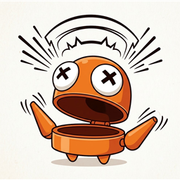

# DeathSound

A BepInEx mod for R.E.P.O. that replaces the death sound with any `.wav` file you
choose.

## What it does

When a player dies, the mod plays a custom sound instead of the game's built-in
death sound. This fires for every player death, not just your own, and everyone
in the lobby who has the mod installed will hear it.

## Usage

1. Install the mod (see below).
2. Go to the mod's folder:
   `<profile>\BepInEx\plugins\Modrats-DeathSound\`
3. Drop any `.wav` file into that folder. The name doesn't matter.
4. Launch/restart the game. Your dropped-in `.wav` replaces the death sound.

If no `.wav` file is present in the folder, the mod does nothing and the
game's original death sound plays as normal.

Only one `.wav` is used at a time. If multiple `.wav` files are present, the
mod picks one (alphabetically first) - remove the ones you don't want active.

## Requirements

- Every player who wants to hear the replacement sound needs this mod
  installed locally with their own `.wav` file. It's a client-side mod; there's
  no server component and nothing is downloaded automatically to other players.

## Installation

Install via r2modman/Gale, or manually place the built `DeathSound.dll` in
`BepInEx\plugins\Modrats-DeathSound\`.

## Credits

This mod ships with no bundled audio - you provide your own sound file.
